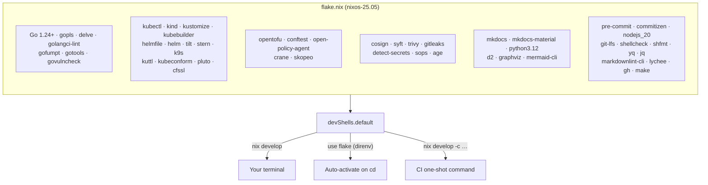

<!-- SPDX-License-Identifier: Apache-2.0 -->
<!-- Copyright (c) 2026 keese-ai -->

# Development environment (Nix)

The keese repo ships a Nix flake that pins every tool used during development and in CI — one `nix develop` command produces the exact same toolchain on any machine or runner.

!!! info "Audience"
    Contributors setting up a local development environment. **Prerequisites:** [Development index](index.md) · [Repository map](repo-map.md)

---

## How the environment is composed

The flake (`flake.nix`) declares a single `devShells.default` shell built with `pkgs.mkShell`. All packages come from `nixpkgs/nixos-25.05`, with a small number of per-platform conditionals (Linux networking tools; macOS `apple-sdk`). A `shellHook` prints a four-step quick-start reminder on every entry.



CI imports the same flake — there is no separate toolchain matrix. If it builds locally, it builds in CI.

---

## Prerequisite — install Nix (with flakes)

Everything below assumes a **flake-enabled Nix** on your `PATH`. keese recommends the [Determinate Nix Installer](https://github.com/DeterminateSystems/nix-installer): it turns on flakes and the unified `nix` CLI by default (stock Nix requires hand-editing `nix.conf`), works the same on macOS and Linux, and ships a clean uninstaller.

```bash
# macOS or Linux — installs Nix with flakes + nix-command enabled
curl --proto '=https' --tlsv1.2 -sSf https://install.determinate.systems/nix | sh -s -- install
```

Open a new terminal (so `nix` lands on your `PATH`) and verify:

```bash
nix --version       # nix (Nix) 2.18 or newer
```

Then bring up the keese dev shell in three steps:

```bash
git clone https://github.com/keese-ai/keese && cd keese
nix develop         # builds the pinned toolchain (~60 s cold, cached after)
make help           # confirm the shell is live — prints the target catalog
```

That is the entire prerequisite. The rest of this page makes shell entry automatic (direnv) and explains what the toolchain contains.

!!! tip "Already running Nix?"
    Stock Nix works too — add `experimental-features = nix-command flakes` to `~/.config/nix/nix.conf` (the Determinate installer sets this for you), then continue below.

---

## Entering the shell

### Option A — direnv (recommended)

Install direnv once (it is included in the flake itself, so a one-time bootstrap with your system package manager suffices):

```bash
# macOS (Homebrew) — one-time bootstrap only
brew install direnv

# then hook direnv into your shell, e.g. ~/.zshrc:
eval "$(direnv hook zsh)"
```

The repo root contains `.envrc`:

```bash
use flake
dotenv_if_exists .env.local
```

After that, `cd` into the repo and allow it once:

```bash
cd /path/to/keese
direnv allow
```

On first entry, Nix evaluates and builds all packages (~60 s cold, instant on subsequent entries from the binary cache). Every subsequent `cd` into the repo activates the shell silently.

### Option B — `nix develop`

```bash
nix develop             # opens an interactive subshell

# or run a single command without entering the shell:
nix develop -c make test-integration
```

### Option C — manual install (fallback)

!!! warning "Divergence risk"
    A manual install will not stay pinned to the same versions as CI. Use this path only if Nix is unavailable (e.g. a locked-down corporate laptop). Periodically cross-check tool versions against `flake.nix`.

Minimum required tools for basic `make generate / make manifests` work:

| Tool | Minimum version | Install hint |
|---|---|---|
| Go | 1.24 | https://go.dev/dl/ |
| kubectl | 1.30 | https://kubernetes.io/docs/tasks/tools/ |
| kustomize | 5.x | `go install sigs.k8s.io/kustomize/kustomize/v5@latest` |
| kubebuilder | 4.x | https://book.kubebuilder.io/quick-start |
| kind | 0.24+ | https://kind.sigs.k8s.io/ |
| tilt | 0.33+ | https://docs.tilt.dev/install.html |
| pre-commit | 3.x | `pip install pre-commit` |

Tools marked as `# unverified` in `flake.nix` (operator-sdk, setup-envtest, controller-gen, ctlptl, cmctl, argo) must be installed separately with `go install` or their upstream installers regardless of path.

---

## Toolchain groups at a glance

| Group | Key packages | Purpose |
|---|---|---|
| Go toolchain | `go`, `gopls`, `delve`, `golangci-lint`, `gofumpt`, `govulncheck` | Build, format, lint, debug, audit |
| Kubernetes | `kubectl`, `kind`, `kubebuilder`, `kustomize`, `tilt`, `helmfile`, `kuttl`, `stern`, `k9s` | Local cluster, controller codegen, E2E |
| Supply chain | `cosign`, `syft`, `trivy`, `gitleaks`, `detect-secrets`, `sops`, `age` | Sign, SBOM, scan, secret management |
| Docs | `mkdocs`, `mkdocs-material`, `d2`, `mermaid-cli`, `markdownlint-cli`, `lychee` | Book site, diagrams, link-check |
| Cloud infra | `opentofu`, `conftest`, `open-policy-agent` | Terraform-compatible cloud deploy, policy |
| Container | `crane`, `skopeo` | OCI image manipulation |
| Commit hygiene | `pre-commit`, `commitizen`, `nodejs_20`, `git-lfs`, `shellcheck`, `shfmt` | Conventional Commits, hook enforcement |

!!! note
    `operator-sdk`, `setup-envtest`, `controller-gen`, `ctlptl`, `cmctl`, and `argo` are not yet verified in `nixpkgs` stable. Comments in `flake.nix` mark them. A `nix/overlays/operator-tools.nix` overlay or `go install` is the current fallback for those tools.

---

## .env.local — secrets for the dev loop

`.env.local` is **gitignored**. Copy the template and fill in values before your first `make` run:

```bash
cp .env.local.example .env.local
$EDITOR .env.local
```

The `.envrc` directive `dotenv_if_exists .env.local` loads it into your shell automatically when direnv is active. The file is never sourced in CI — CI credentials arrive via GitHub OIDC or repository secrets.

The table below covers every section in `.env.local.example`:

| Section | Variables | Notes |
|---|---|---|
| Agent runtime | `GOOSE_PROVIDER`, `GOOSE_MODEL`, `ANTHROPIC_API_KEY` | Provider defaults to `anthropic`; model to `claude-opus-4-7`. Only one provider key is needed. |
| OpenFGA | `OPENFGA_API_URL`, `OPENFGA_STORE_ID`, `OPENFGA_AUTHORIZATION_MODEL_ID` | Local dev store at `http://localhost:8080` by default. |
| OpenBao | `BAO_ADDR`, `BAO_TOKEN` | Local dev vault at `http://localhost:8200`. |
| NATS JetStream | `NATS_URL` | `nats://localhost:4222` for the local bootstrap. |
| Envoy AI Gateway | `EGRESS_GATEWAY_URL`, `EGRESS_EXT_AUTHZ_CLUSTER`, `EGRESS_SA_AUDIENCE_TEMPLATE` | Template: `keese-egress-{TENANT}`. |
| OTEL | `OTEL_EXPORTER_OTLP_ENDPOINT`, `OTEL_SERVICE_NAME`, `OTEL_SERVICE_VERSION` | Collector on `localhost:4317`. |
| Elastic / APM | `ELASTIC_USERNAME`, `ELASTIC_PASSWORD`, `APM_TOKEN` | Required only for observability testing. |
| Kind / Tilt | `KIND_CLUSTER_NAME`, `TILT_HOST` | Defaults: `keese-dev` / `127.0.0.1`. |
| Registries | `IMG`, `BUNDLE_IMG` | Commented out; set to push a dev image to a personal registry. |
| Envtest | `KUBEBUILDER_ASSETS` | Auto-set by `make envtest-setup`; override only if needed. |
| OpenTofu cloud | `TF_VAR_*` | Commented out; required only for cloud deploy work. |
| Worktree base | — | koryph manages its own worktree root; see `worktree_root` in `~/.koryph/registry.d/keese.json`. |

!!! danger "Never commit .env.local"
    `.env.local` contains real credentials. The `gitleaks` and `detect-secrets` pre-commit hooks will catch accidental staging, but prevention is better than detection. Keep the file out of version control entirely.

---

## Secret flow in the dev loop

```mermaid
flowchart LR
    subgraph local["Developer workstation"]
        envlocal[".env.local<br/>(gitignored)"]
        direnv["direnv / nix develop"]
        shell["Shell env<br/>(ANTHROPIC_API_KEY, BAO_TOKEN, …)"]
        make["make / Tilt"]
        op["Operator process<br/>(cmd/operator/main.go)"]
    end
    subgraph cluster["kind cluster (local)"]
        bao["OpenBao<br/>localhost:8200"]
        eso["ExternalSecrets Operator"]
        k8ssecret["K8s Secrets<br/>(projected volumes)"]
        gateway["Envoy AI Gateway<br/>localhost:10000"]
    end
    envlocal -->|"dotenv_if_exists"| direnv
    direnv --> shell
    shell --> make
    make --> op
    op -->|"dev-mode direct"| bao
    bao --> eso
    eso --> k8ssecret
    k8ssecret -->|"projected mount<br/>/var/run/keese/secrets/"| gateway
```



In a local kind cluster, the operator uses `BAO_ADDR` / `BAO_TOKEN` from the environment to bootstrap the dev vault. Agent pods never see raw credentials — they receive projected ServiceAccount tokens, and the gateway swaps them for upstream credentials at egress. See [Credential broker](../concepts/credential-broker.md) for the full in-cluster flow.

---

## Finishing first-time setup

After entering the shell, run these four steps (printed by the `shellHook`):

```bash
# 1. fill in local secrets
cp .env.local.example .env.local && $EDITOR .env.local

# 2. install pre-commit hooks (runs on every commit thereafter)
pre-commit install --install-hooks

# 3. activate Git LFS (large binary assets)
git lfs install

# 4. list available make targets
make help
```

!!! tip
    Run `make generate && make manifests` before your first build to ensure all CRD DeepCopy stubs and RBAC markers are up to date. The controller codegen tools (`controller-gen`) must be installed via the overlay or `go install`; see the note above.

---

## Adding or upgrading a tool

```bash
# 1. edit flake.nix — add the package to the packages list
$EDITOR flake.nix

# 2. if you bumped a flake input (e.g. moved to nixos-unstable):
nix flake update          # updates flake.lock

# 3. reload the shell
direnv reload             # or: exit subshell, re-run nix develop

# 4. commit both files together
git add flake.nix flake.lock
git commit -m "build(nix): add <tool>"
```

---

## Binary caches

Cold starts pull packages from the default `cache.nixos.org`. For faster cold starts you can add a personal or community cachix bucket:

```bash
cachix use nix-community   # optional — user decision
```

Do not hard-code organization caches in `flake.nix` — that is a per-user decision in `~/.config/nix/nix.conf`.

---

## Troubleshooting

| Symptom | Fix |
|---|---|
| `nix develop` hangs on "evaluating" | Kill it, run `rm -rf ~/.cache/nix/eval-cache-v5`, retry |
| Wrong tool version / tool not found | Confirm you are inside the shell: `which go` should point into `/nix/store/…` |
| Tool not found after editing `flake.nix` | Run `direnv reload` or exit and re-enter the subshell |
| `unable to find apple-sdk` on macOS | Update nixpkgs to `>= 24.11` in `flake.nix` inputs |
| `controller-gen: command not found` | Install via `go install sigs.k8s.io/controller-tools/cmd/controller-gen@latest` (overlay planned) |
| `setup-envtest: command not found` | Run `make envtest-setup` which installs it under `bin/` |

---

## See also

- [Repository map](repo-map.md) — directory layout and what lives where
- [Bootstrap a local cluster (kind + Tilt)](../guides/bootstrap-local.md) — next step after the shell is ready
- [SDLC & the design gate](sdlc.md) — branch conventions, pre-commit hooks, and gate checks
- [CI/CD pipeline](cicd.md) — how the same flake is used in GitHub Actions
